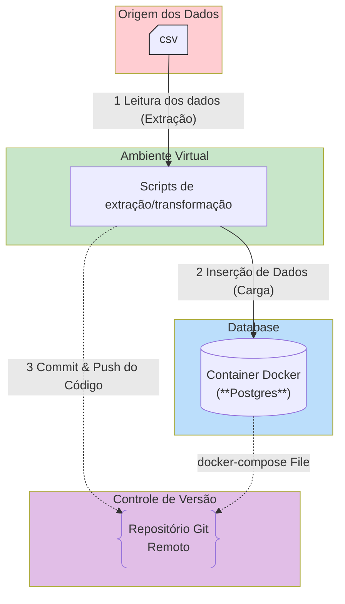

# DesafioDados

## 1. Objetivo

O propósito é avaliar a proficiência no desenvolvimento de rotinas de manipulação de dados, configuração de ambientes isolados, conteinerização de infraestrutura e versionamento de código.

Uma pipeline simples de ETL (Extract, Transform, Load) utilizando Python, consumindo de um csv de origem para um banco de dados de destino hospedado localmente.

## 2. Requisitos/Escopo da Atividade

1. **Configuração de Ambiente Isolado:**
	- Inicializar e configurar um ambiente virtual Python (venv ou equivalente, como poetry ou pipenv, a recomendação uv) para isolar as dependências do projeto.
    
2. **Extração de Dados/Normalização:**
	- Utilizar bibliotecas de leitura de dados para extrair e tratar tipos de dados.
	- Fazer a inferência de tipo nas colunas, de objetivo para o tipo correto.
	- Elaborar e executar SQL para inserir o conjunto de dados.
    
3. **Infraestrutura Local (Target):**
	- Provisionar um banco de dados local utilizando Docker (docker-compose.yml).
    

4. **Carga de Dados (Load):**
	- Desenvolver o script Python responsável por ler os dados da origem e inseri-los no banco de dados local (Docker).
	- Garantir a integridade e atomicidade dos dados durante a transferência.
    
5. **Versionamento e Entrega:**
	- Inicializar um repositório local utilizando Git.
	- Commits semânticos para o código-fonte desenvolvido, arquivos de configuração (requirements.txt, docker-compose.yml).
	- Efetuar o envio (push) do código para o repositório remoto **em uma branch diferente da main**.

